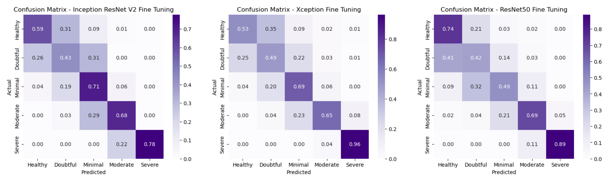
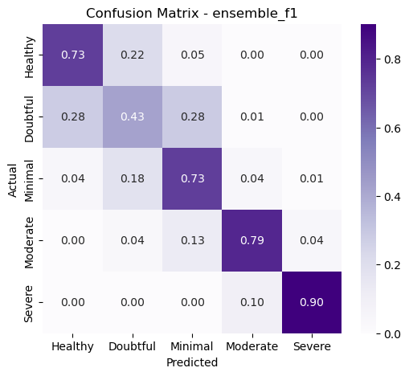

# Knee Osteoarthritis Analysis with X-ray Images using Deep Convolutional Neural Networks

This repository was developed as part of an AI in Healthcare Hackathon.

## 🦵 About Knee Osteoarthritis

[Knee osteoarthritis](https://en.wikipedia.org/wiki/Knee_arthritis) is a degenerative joint disease caused by the gradual wearing of cartilage that cushions the bones in the knee. This leads to joint pain, stiffness, and loss of mobility.
Diagnosis is typically based on X-ray or MRI scans, which reveal the narrowing of joint spaces—an important indicator of OA severity.

## 🏷 KL Grading System
The Kellgren-Lawrence (KL) grading system is a standard method used to classify the severity of knee osteoarthritis:
The severity of osteoarthritis was classified into 5 levels based on [KL
score](https://www.ncbi.nlm.nih.gov/pmc/articles/PMC4925407/), from the healthy
level to the severe level, where the greater the degree of severity, the smaller
the spacing of the joint.

- KL score:
    - Grade 0: Healthy
    - Grade 1: Doubtful 
    - Grade 2: Minimal 
    - Grade 3: Moderate 
    - Grade 4: Severe

The following image shows the different levels from [Knee Osteoarthritis Dataset
with Severity
Grading](https://www.kaggle.com/datasets/shashwatwork/knee-osteoarthritis-dataset-with-severity).


## 🎯 Project Objective

To build an AI model that automatically classifies the severity of knee osteoarthritis from X-ray images using deep learning and provides a user-friendly prediction tool.

## 🗂 Project Structure

```shell
.
├── README.md
├── app
│   ├── app.py
│   └── img
├── assets
├── dataset
│   ├── test
│   ├── train
│   └── val
├── environment.yml
└── src
    ├── 01_data_preparation.ipynb
    ├── 02_ensemble_models.ipynb
    ├── 02_model_inception_resnet_v2.ipynb
    ├── 02_model_resnet50.ipynb
    ├── 02_model_xception.ipynb
    ├── 03_best_model_on_test_xception.ipynb
    └── models
        └── model_Xception_ft.hdf5
```

## ⚙️ Setup Instructions

How does the Web App to **predict** knee osteoarthritis grade using **Deep
Learning** and **Streamlit** works?

### 🔁 Clone the Repository

https://github.com/shebin-zeo/Classification-of-Knee-Osteoarthritis-Using-Deep-Learning.git
cd Knee_OST

### 🐍 Create & Activate Conda Environment

   ```shell
conda env create -f environment.yml
```


- Activate the environment

    ```shell
    (base) C: conda activate knee_dl_app
    ```

### 📦 Download Model & Dataset

- Download `model_Xception_ft.hdf5` model from
   [here](https://drive.google.com/file/d/127PBwVOjh-DUbHabEhpd_kR5B2BSPaAd/view?usp=drive_link)
   to run the application. Create `models` folder and copy the model here.

    ```shell
    (knee_dl_app) C: mkdir src/models
    ```

- Download the dataset from [Knee Osteoarthritis Dataset with Severity
   Grading](https://www.kaggle.com/datasets/shashwatwork/knee-osteoarthritis-dataset-with-severity)
   to train the model and test the application. Create `dataset` folder and copy
   the data here.

    ```shell
    (knee_dl_app) C: mkdir dataset
    ```

### 🚀 Launch the Streamlit App

  ```shell
streamlit run app/app.py
```


    As soon as you run the script, a local Streamlit server will spin up, and
    your app will open in a new tab in your default web browser.

    Or you can navigate to `http://localhost:8501`.

## 🔬 Methodology

The following methodology has been proposed to correctly classify the degree of
osteoarthritis based on X-ray images:

1. Data preparation
2. Model training
3. Model evaluation
4. Web application development with the best model

### 1. 📊 Data Preparation

The dataset consists of ~8000 X-ray images, split into training, validation, and test sets. Data distribution is imbalanced across the KL grades.
    Class balancing techniques:
        Weighted loss functions
        Data augmentation (e.g., flipping, brightness/zoom/shift changes)
        Preprocessing for transfer learning

> See [01_data_preparation.ipynb](src/01_data_preparation.ipynb) notebook.

### 🧠 Model Training

#### Pre-trained Networks

Three pre-trained networks were chosen:
[Xception](https://arxiv.org/abs/1610.02357),
[ResNet-50](https://arxiv.org/abs/1512.03385) e [Inception Resnet
v2](https://arxiv.org/abs/1602.07261v2). 

The following table presents the summary of the partial results obtained in the
implementation of the different pre-trained networks with fine tuning. Our
metrics is Balanced Accuracy. Models were trained on Apple M1 Pro chip with
8-core CPU, 14-core GPU and 16-core Neural Engine.

| Model                           | Balanced Accuracy | Time Execution |
| ------------------------------- | ----------------- | -------------- |
| Xception fine tuning            | 67%               | 68min          |
| ResNet50 fine tuning            | 65%               | 80min          |
| Inception_resnet_v2 fine tuning | 64%               | 56min          |



Highlighting, the highest success rate of each model by class, we have:

- Inception ResNet classified the minimal class better
- Xception classified the doubtful and severe classes better
- ResNet50 classified the healthy and moderate classes better

> See [02_model_inception_resnet_v2.ipynb](src/02_model_inception_resnet_v2.ipynb)

> See [02_model_xception.ipynb](src/02_model_xception.ipynb)

> See [02_model_resnet50.ipynb](src/02_model_resnet50.ipynb)
   
#### 🤝 Ensemble Modeling

Three ensemble approaches were performed with the previous results:

- One calculating the average, and two calculating the weighted average of the
  accuracy and f1 of each class.

| Model             | Balanced Accuracy | Time Execution |
| ----------------- | ----------------- | -------------- |
| Ensemble mean     | 68.63%            | 16seg          |
| Ensemble accuracy | 68.48%            | 16seg          |
| Ensemble f1       | 68.69%            | 16seg          |


The three models had similar results, but we selected the **ensemble with f1 model**.

> See [02_ensemble_models.ipynb](src/02_ensemble_models.ipynb)

### Model evaluation

We evaluated the [best model](src/02_ensemble_models.ipynb) in the test set, a
balanced accuracy of 71% was obtained, and in the confusion matrix we can
observe the highlight of the moderate and severe classes.



#### Explainability

We implemented the [Grad-CAM](https://arxiv.org/abs/1610.02391) explainability
technique to better understand how classes are classified. The Grad-CAM
indicates the parts of the image that most impact the classification score.

We can see in the images that for the healthy, doubtful and minimal classes, the
most prominent areas are located in the center of the knee, and the moderate and
severe classes are most prominent on the right or left edges of the knee.

Grad-CAM results were obtained from the last convolutional layer of the
[Xception](src/02_model_xception.ipynb) model.


> See [03_best_model_on_test_xception.ipynb](src/03_best_model_on_test_xception.ipynb)

### 🌐 Streamlit Web App

The developed web application offers a complete interactive experience to aid clinicians and researchers in diagnosing Knee Osteoarthritis:

### ✅ Core Features:
Upload X-ray Image
Users can upload knee X-ray images through a simple UI.
Predict Osteoarthritis Grade (KL Score)
The app predicts one of the 5 KL grades (0–4) based on deep learning models.
Display Classification Probabilities
Confidence levels for each grade are shown to support decision-making.
Visualize Grad-CAM Heatmaps
Highlights the key regions of the X-ray influencing the model's decision using Grad-CAM.

### 🧠 Additional Features:
🗨️ Patient Query Answering with DeepSeek R1
A built-in chatbot powered by DeepSeek R1 helps answer patient and user queries related to:
Symptoms and progression of knee OA
Interpretation of KL grades
Recommended lifestyle modifications or treatments
Information about X-ray vs MRI differences

### 🦵 Interactive 3D Visualization of the Knee
Integrated 3D anatomical modeling allows users to:
Explore the knee joint's structure
Understand affected areas in each OA grade
Rotate, zoom, and pan for a better spatial understanding

### 🏥 Hospital Recommendation (if not Healthy)
If the predicted result is not Grade 0 (Healthy), the app will:
Display a list of nearest orthopedic/OA specialty hospitals
Use location data to provide directions or contact information
Prompt the user to seek medical consultation for further evaluation


####  YouTube

[](https://youtu.be/WiZoV8PJ_tQ "Knee Arthritis X-ray Stages: What You Need To Know")


## References

- [Knee Osteoarthritis Dataset with Severity
  Grading](https://www.kaggle.com/datasets/shashwatwork/knee-osteoarthritis-dataset-with-severity)
- [Transfer Learning-Based Smart Features 
  Engineering for Osteoarthritis Diagnosis
   From Knee X-Ray Images](https://ieeexplore.ieee.org/stamp/stamp.jsp?tp=&arnumber=10179858)
- [ Machine Learning-Based Automatic Classification
 of Knee Osteoarthritis Severity Using Gait Data
 and Radiographic Images
 ](https://ieeexplore.ieee.org/stamp/stamp.jsp?tp=&arnumber=9130657)

---

made with  by 👨‍💻 [Mohamed Shebin T P](https://github.com/shebin-zeo)
